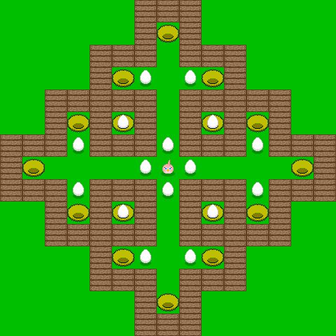

# Java-Sokoban-Game
Java Sokoban game source code

http://zetcode.com/tutorials/javagamestutorial/sokoban/

https://github.com/Drachenbauer/AngryBirdsSokoban

This is now an Angry Birds style version.

I turned the player-dot into a bird from the Angry Birds flock.  
I turned the baggage into eggs.  
I turned the storage area into nests.  
And I added six wall-styles similar to the piggie-construct-materials in the official Angry Birds Games.

code-changes:

-four direction-sprites and hopping-animation for the bird (player)

-many levels to choose from by dialog

-11 bird-characters to choose from by dialog

-eight wall-desighns to choose from by dialog

-saves progress and choosen bird and walls in an ini-file

-level-dialog shows wich levels are solved

-solving a level starts the next one

-added progress-strings to show number of solved eggs and as a step-counter

-added an undo-steps-function

Controls:

arrow-keys:  
Move the bird.  
Move against eggs to push them.  
You can´t push more than one egg with one move.  
If you try to push two or more eggs in a row, your bird doesn´t move.

backspace-key:  
Undo moves.  
You can undo all moves you made so far in the level.

R-key:  
Restart the actual level.

L-key:  
Open level-chooser-dialog (select a level in the drop-down-list).

B-key:
Open bird-chooser-dialog (11 bird-characters to choose from)

W-key:  
Open wall-design-chooser-dialog (eight wall-designs to choose from).